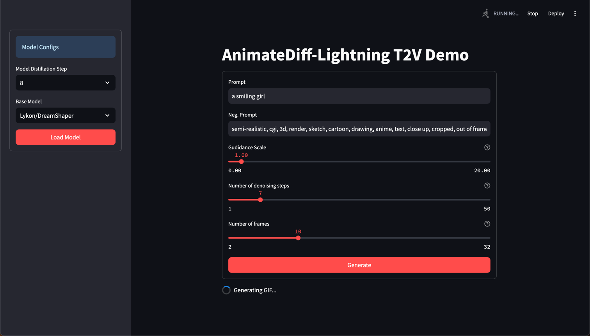
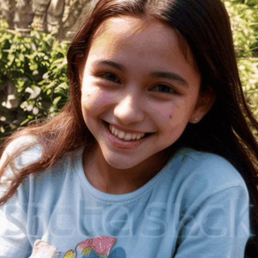

# Text2Video Demo

The task presented was to create a demo of a Text2Video model with the
context that such a solution could be provided to a client. 

## TODO
-  Add Motion LoRAs as they produce stronger motion

## How to get started?
- make sure to install the dependecies listed in the `requiremnts.txt`
- execute in terminal , `streamlit run animate-diff-app.py`

## Choice of Architecture
For the architecture I have chosen [*AnimateDiff*](https://arxiv.org/abs/2307.04725). 
The major reasons for choosing this architecture include:
 - The recent advancements in text-to-image (T2I) diffusion models (e.g., Stable Diffusion) and 
corresponding personalization techniques such as DreamBooth and LoRA, everyone can manifest their imagination 
into high-quality images at an affordable cost. AnimateDiff, a practical framework for animating per- sonalized T2I 
models without requiring model-specific tuning.
 - This implies that most diffution models already available can be used to generate videos.
 - MotionLoRA, a lightweight fine-tuning technique for AnimateDiff that enables a pre-trained motion module to adapt to 
new motion patterns, such as different shot types, at a low training and data collection cost.
 - The huge community behind AnimateDiff and MotionLoRA also enables fast prototyping and need for less R&D to 
tailor to a final product.
 - Since computational resources available to me are limited, I have used AnimateDiff-Lightning which is a fast model 
distilled from the original AnimateDiff SD1.5 v2

## UI
I have also made a simple UI using Streamlit to showcase the models performance. 

### Some example generation
Prompt: A smiling girl.  
Base Diffusion Model: `emilianJR/epiCRealism`

_Some not so desirable_  
Prompt: A boy playing.  
Base Diffusion Model: `emilianJR/epiCRealism`

## Limitations
- Due to the limited computational resources, to keep the generation time to below 3 minutes. I had to limit number of 
frames to 10 and number of denoising steps to 7. Moreover the most distilled version of the model was used. 

## Possible improvements
- Prompt optimizations have not been done and could possibly improve results, similarly more through hyper-parameter 
optimization could also yield better results.
- Only a few number of diffusion T2I models were tested on. 
