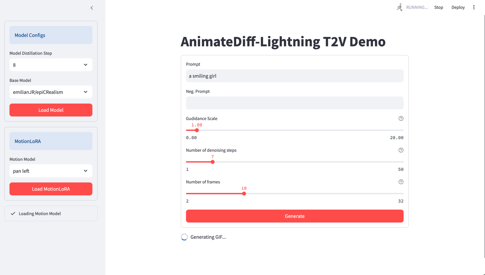
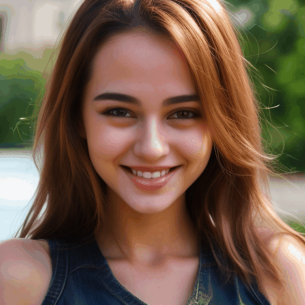
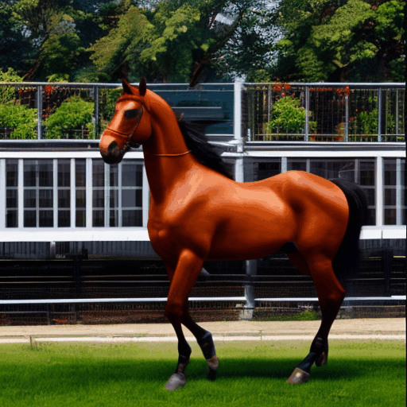

# Text2Video Demo

The task presented was to create a demo of a Text2Video model with the
context that such a solution could be provided to a client. 

## How to get started?
- make sure to install the dependecies listed in the `requiremnts.txt`
- execute in terminal , `streamlit run animate-diff-app.py`

## Choice of Architecture
For the architecture I have chosen [*AnimateDiff*](https://arxiv.org/abs/2307.04725). 
The major reasons for choosing this architecture include:
 - The recent advancements in text-to-image (T2I) diffusion models (e.g., Stable Diffusion) and 
corresponding personalization techniques such as DreamBooth and LoRA, everyone can manifest their imagination 
into high-quality images at an affordable cost. AnimateDiff, a practical framework for animating per- sonalized T2I 
models without requiring model-specific tuning.
 - This implies that most diffution models already available can be used to generate videos.
 - MotionLoRA, a lightweight fine-tuning technique for AnimateDiff that enables a pre-trained motion module to adapt to 
new motion patterns, such as different shot types, at a low training and data collection cost.
 - The huge community behind AnimateDiff and MotionLoRA also enables fast prototyping and need for less R&D to 
tailor to a final product.
 - Since computational resources available to me are limited, I have used AnimateDiff-Lightning which is a fast model 
distilled from the original AnimateDiff SD1.5 v2. Said to imporove generation speeds by more than 10x.

### Other Models

#### Text2Video-Zero
This model is similar to the one used as it uses a diffution based model for T2I to create videos.  However, the AnimateDiff
paper which came out after the Text2Video-Zero compares the two models where the AnimateDiff seems to be better in many cases.

#### Open-Sora
Open Sora is an Open Source T2V model. It seems to be able to produce much higher quality videos with the ability to handle
longer prompts but with the downside needing fine-tuning to adhere to any particular style, etc. 

## UI
I have also made a simple UI using Streamlit to showcase the model performance.

- The sidebar gives the user the choice for choosing the distillation of the `AnimeteDiff-Lightning` model, generally the
larger the distillation the smaller the model and hence faster but in the expense of quality. It also lets the user
choose the base model, currently a choice of two models are provided `emilianJR/epiCRealism` and `Lykon/DreamShaper`. 
- The lower section of the sidebar gives the user the option to add MotionLoRA adaptors, these as the name suggests
imparts more motion to the generation. Various choices including pan-left, pan-right, zoom-in, zoom-out, etc are provided.
- The main section of the webpage lets the user provide the various settings for generating the image, including the prompts, 
guidance scale, the number of denoising steps, and the number of frames. Note that the small question mark next to each settings 
provides a help statement to the user.

### Some example generation
Prompt: A smiling girl.  
Base Diffusion Model: `emilianJR/epiCRealism`  

_With motion adaptors_  
Prompt: A prancing hourse.  
Base Diffusion Model: `emilianJR/epiCRealism`  
MotionLoRA Model: `guoyww/animatediff-motion-lora-pan-left`    

## Limitations
- Due to the limited computational resources, to keep the generation time to below 3 minutes. I had to limit number of 
frames to 10 and number of denoising steps to 7. Moreover the most distilled version of the model was used. 

## Possible improvements
- Prompt optimizations have not been done and could possibly improve results, similarly more through hyper-parameter 
optimization (like the choice of schedulers) could also yield better results.
- This model also allows the use of SparseCtrl, where the user can provide a sketch or an image as reference.
- This model is also compatitiable with FreeInit, which could help with temporal consistency and video quality in the
expense of compute.
- Currently the demo only supports the use of a single MotionLoRA module and that too without contorl over its weight. 
- Only a few number of diffusion T2I models were tested on. 
- The UI is very basic and does not look the best.

## Files

- `animate-diff-app.py`: Streamlit app
- `animate-diff-demo.py`: Sample script for AnimateDiff model
- `animate-diff-lightning-demo.py`: Sample script for AnimateDiff-Lightning model
